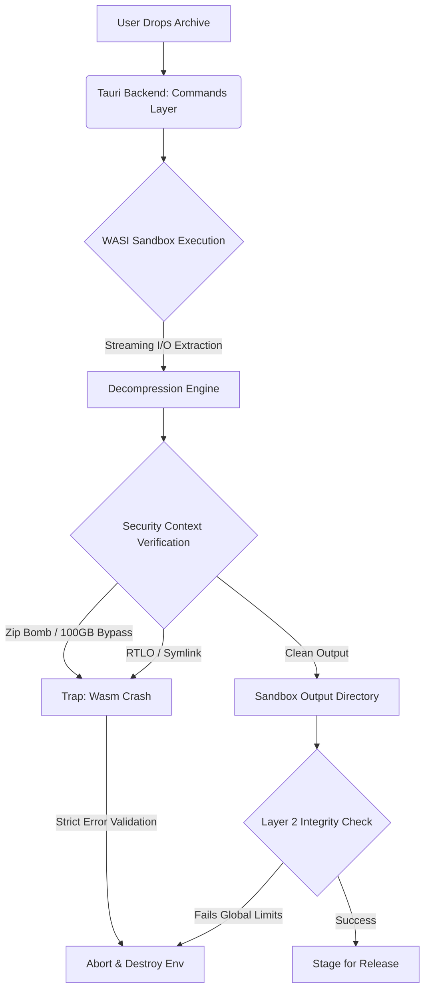
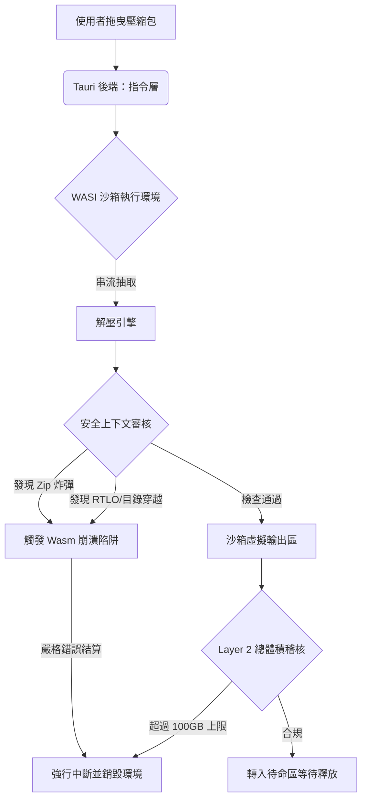

# 🛡 ZDefuser

      
> Zero-Trust Sandboxed Extraction for macOS, Linux, & Windows.  
> 專屬工程師與資安研究員的跨平台終極物理隔離解壓縮防護傘。

---

[English](#english) | [繁體中文](#繁體中文)

---

<br>

<h2 id="english">English</h2>

**ZDefuser** is a highly secure archive extraction tool built for engineers and security researchers. By combining unidirectional WebAssembly (Wasm) isolation technology with the native OS interface, it analyzes and extracts `.zip`, `.rar`, `.tar`, and `.tar.gz / .tgz` files of unknown origins within a "purely physically isolated" sandbox. This effectively blocks malicious payloads from penetrating or damaging the host system during the exact moment of decompression.

### Why ZDefuser?
Traditional OS archiving tools run with full native file permissions, providing hackers a perfect window for exploitation. ZDefuser drops the payload into a WebAssembly sandbox—completely cut off from networking and native OS calls. This "sterile extraction" guarantees immunity against **8 advanced threat vectors**:

1. 💣 **Zip Bomb & CPU DoS Defusion**: Enforces strict resource ratios (max 100x inflation / 100GB limits) and integrates **Dynamic Compute Rationing (Dynamic Fuel)** to intercept both volumetric memory exhaustion attacks and infinite-loop mathematical bombs.
2. 🚫 **Path Traversal Blocking**: Drops any hazardous relative paths like `../../etc/passwd` attempting to escape the sandbox and overwrite the system.
3. 🔗 **Symlink Attack Isolation**: Zero tolerance for illegal directory references and symbolic shortcuts, protecting host private keys and config files from stealthy exfiltration.
4. 🛡 **RCE / Buffer Overflow Immunity**: Even if the internal extraction engine suffers a buffer overflow, it will only trigger a Wasm linear memory trap crash. It is physically impossible to penetrate the host.
5. 🪟 **Unicode Spoofing (RTLO) Protection**: Sanitizes malicious Right-to-Left Override sequences inside paths, ensuring stealthy `invoice[RTLO]xcod.exe` files cannot be masqueraded as harmless `.docx` files.
6. 🔒 **Executable Bit Stripping (Unix Only)**: Through the Layer-3 Release Gate, any stealthy `+x` script permissions implanted by attackers are forcibly stripped, downgrading malicious executables to harmless text chunks.
7. 🗄️ **Encrypted Vector Neutralization**: Safely handles AES-encrypted ZIPs and RARs. Even if an archive mandates a password and harbors malware, the decryption process and structural validation occur strictly within the quarantine zone.
8. 🕵️ **Network Leakage Prevention**: WASI network sockets are entirely disabled. Extracted spyware physically cannot ping external command-and-control servers or exfiltrate data.

### Zero-Trust Architecture Flow


### Tech Stack
* **Host**: [Tauri v2](https://v2.tauri.app/) (Rust)
* **Isolated Virtual Machine (Sandbox)**: [Wasmtime v29](https://wasmtime.dev/) (`wasm32-wasip1`)
* **Frontend UI**: React + TypeScript + Vite + Vanilla CSS (Dark minimal aesthetics)
* **Inter-process Communication**: Async Tokio MPSC Channels

### 📜 Enterprise Legal Compliance & Dual Licensing
ZDefuser features an automated Third-Party License orchestration pipeline (`generate_licenses.py`) integrated into the build process, ensuring full compliance with underlying MIT/Apache dependencies.

**Commercial & Enterprise Usage**
ZDefuser is distributed under a **Dual License Strategy**:
1. **Open Source (GNU AGPLv3)**: Free for personal use, hobbyists, and non-commercial research, provided you comply with the strong copyleft terms of the AGPLv3 (any server/backend deployment of this tool obligates you to open-source your entire surrounding architecture).
2. **Commercial Enterprise License**: If your organization wishes to use ZDefuser internally, embed it in commercial products, or deploy it in a cloud backend *without* being forced to open-source your proprietary code, you must purchase a **Commercial License Bypass**. Please contact the maintainers for enterprise EULA details.

### 📥 Download & Installation
You can grab the latest pre-compiled binaries from the **[GitHub Releases](https://github.com/Cyber-Sec-Space/zdefuser/releases)** page. We offer cross-platform support:
- **Windows**: `.exe` and `.msi` installers.
- **Linux**: `.AppImage` (Portable) and `.deb` (Debian/Ubuntu) packages.
- **macOS**: `.dmg` bundles.

> **🍎 macOS Security Notice (Unsigned App):**
> Because this application is not natively code-signed with an Apple Developer Certificate, Gatekeeper will block the app upon first launch with a warning like "App is damaged and can't be opened".
> **To fix this:** open your Terminal and run the following command to remove the quarantine attribute:
> ```bash
> xattr -cr /Applications/ZDefuser.app
> ```

### Development & Build Instructions
Ensure you have the Node.js and Rust toolchains (including the `wasm32-wasip1` target) installed.

```bash
# 1. Clone the repository
git clone https://github.com/Cyber-Sec-Space/zdefuser.git

# 2. Install frontend dependencies
npm install

# 3. Prepare the WASM Sandbox environment
rustup target add wasm32-wasip1
cd wasm-sandbox
cargo build --target wasm32-wasip1 --release
cd ..

# 4. Kickstart developer mode
npm run tauri dev
```
> **⚠️ Developer Note:** `npm run tauri dev` automatically recompiles the Rust host (`ZDefuser`), but it does **not** track or auto-compile the inner Wasm binary. If you modify any code inside `/wasm-sandbox`, you must manually re-run `cargo build --target wasm32-wasip1 --release` and touch `wasm.rs` before the host registers the sandbox changes!

### Security Penetration Testing
Included with built-in realistic penetration verification payloads.  
You can run the script `python3 tests/generate_payloads.py` to generate authentic malicious archives, including Zip Bombs, Path Traversals, and executable hijacks, and witness the defensive mechanisms in action via the UI interface.

> _"In a zero-trust world, even air doesn't pass verification without inspecting its atoms."_ 

**Audited securely by Snyk 🐶 - 0 Vulnerabilities Detected.**

---

<br>

<h2 id="繁體中文">繁體中文</h2>

**ZDefuser** 是一個為工程師與資安研究員打造的極致安全解壓縮工具。透過整合 WebAssembly (Wasm) 單向隔離技術與原生作業系統介面，它能在「純物理隔離」的虛擬沙箱內剖析未知來源的 `.zip`、`.rar`、`.tar` 甚至 `.tar.gz / .tgz` 檔案，有效阻斷惡意程式在解壓縮瞬間造成的系統滲透與破壞。

### 為什麼需要 ZDefuser？
傳統的作業系統解壓工具具備過高的原生檔案權限，這讓駭客有機可乘。ZDefuser 將檔案丟進無實體網路、無作業系統呼叫權限的 WebAssembly 沙箱中進行「無菌抽取」，徹底免疫以下**八大進階解壓縮威脅向量**：

1. 💣 **解壓炸彈與 CPU 劫持防殺 (Zip Bomb & CPU DoS)**：雙效合一。採用硬性資源比例上限 (最高 100 倍膨脹) 防禦記憶體溢出，並搭配 **動態算力配給制 (Dynamic Compute Rationing)** 依據檔案大小發放精準的 Wasmtime 運算燃料指令配額，幾秒內自動絞殺無窮迴圈型邏輯炸彈。
2. 🚫 **目錄穿越 (Path Traversal)**：攔截所有 `../../etc/passwd` 等企圖跳脫沙箱覆寫系統檔案的危險路徑。
3. 🔗 **符號連結 (Symlink) 隔離**：對非法目錄參照與符號捷徑做到零容忍丟棄，防護主機私鑰與配置檔遭到無痕竊取。
4. 🛡 **任意代碼執行 (RCE/Buffer Overflow) 免疫**：就算底層解壓涵式庫發生緩衝區溢位，也只會導致 Wasm 線性記憶體陷阱崩潰，物理上絕對無法滲透宿主機。
5. 🪟 **Unicode 視覺詐騙 (RTLO) 防護**：過濾掉在檔名中安插的 U+202E 逆向反轉字元，讓偽裝成 `.docx` 的惡意可執行檔原形畢露並強行拋棄。
6. 🔒 **剝除可執行權限 (Executable Bit Stripping - 限 Unix 系統)**：經過 Layer 3 釋放閘道 (Release Gate)，駭客植入的隱形 `+x` 可執行權限會被強制扒除，將腳本檔案降級為無害純文字。
7. 🗄️ **加密向量中和 (Encrypted Vector Neutralization)**：完美安全處理附加密碼的 AES ZIP 與 RAR。即使解壓縮過程包含惡意負載或偽造的校驗碼，所有的解密運算與演算法審核皆強制關押在無菌隔離區內進行。
8. 🕵️ **網路外洩阻隔 (No Network Leakage)**：徹底閹割 WASI 的網路通訊協定，從根源確保被解壓縮的間諜軟體絕對無法連回外部指令與控制 (C2) 伺服器傳送資料。

### 零信任沙箱隔離架構 (Zero-Trust Data Flow)


### 核心技術棧 (Tech Stack)
* **宿主架構 (Host)**: [Tauri v2](https://v2.tauri.app/) (Rust)
* **隔離虛擬機 (Sandbox)**: [Wasmtime v29](https://wasmtime.dev/) (`wasm32-wasip1`)
* **使用者介面 (Frontend)**: React + TypeScript + Vite + Vanilla CSS (極黑幾何美學)
* **通訊層**: 異步 Tokio 管道 (Async MPSC Channels)

### 📜 企業級合規性與雙重授權 (Dual Licensing)
ZDefuser 專案內建了全自動化的第三方開源條款稽核系統 (`generate_licenses.py`)，**100% 滿足底層 MIT / Apache / BSD 套件的合規宣告要求**。

**商業與企業使用宣告**
為了保護本專案的智慧財產權並提供企業級服務，ZDefuser 採用 **「雙重授權 (Dual License) 戰略」**：
1. **開源授權 (GNU AGPLv3)**：對於個人開發者、學生、與非商業研究用途，您可以免費使用本專案。但請注意 AGPLv3 的極強傳染性——如果您將 ZDefuser 部署於企業後端或重製為服務 (SaaS)，法律會強制要求您將貴公司的整合專案「全數開源」。
2. **企業商業授權 (Commercial License)**：如果您是企業客戶，希望將 ZDefuser 部署於內部正式環境、整合進您的商用產品，且**不願意**將您公司的專屬商業機密代碼強制開源，您必須與作者聯繫並購買 **商業授權合約 (Commercial License Bypass)** 才能合法使用。

### 📥 下載與安裝 (Download & Installation)
您可以直接前往專案的 **[GitHub Releases](https://github.com/Cyber-Sec-Space/zdefuser/releases)** 頁面下載最新編譯完成的跨平台安裝包：
- **Windows**: 提供 `.exe` 取代檔與 `.msi` 安裝檔。
- **Linux**: 提供 `.AppImage` (免安裝執行檔) 與 `.deb` (Debian/Ubuntu)。
- **macOS**: 提供 `.dmg` 映像安裝檔。

> **🍎 macOS 開啟失敗解決方案 (無數位憑證)：**
> 由於目前專案尚未掛載 Apple 開發者數位憑證 (Apple Developer Certificate)，macOS 的安全機制 (Gatekeeper) 可能會跳出「檔案已損壞無法開啟」或「無法識別的開發者」的警告。
> **修復方法：** 請開啟終端機 (Terminal)，並執行以下指令來解除隔離屬性（假設您已拖曳至「應用程式」目錄）：
> ```bash
> xattr -cr /Applications/ZDefuser.app
> ```

### 如何安裝與建置 (Development)
首先確保您已安裝了 Node.js 與 Rust 工具鏈（含 `wasm32-wasip1` target）。

```bash
# 1. 複製專案
git clone https://github.com/Cyber-Sec-Space/zdefuser.git

# 2. 安裝前端依賴
npm install

# 3. 準備 WASM 沙箱環境
rustup target add wasm32-wasip1
cd wasm-sandbox
cargo build --target wasm32-wasip1 --release
cd ..

# 4. 啟動開發者模式
npm run tauri dev
```
> **⚠️ 開發者注意事項：** `npm run tauri dev` 雖然會自動熱重載 Rust 宿主端 (`ZDefuser`)，但它**無法自動偵測並重新編譯**深層的 Wasm 沙箱引擎。若您修改了 `/wasm-sandbox` 內的任何程式碼，必須手動重新執行 `cargo build --target wasm32-wasip1 --release` 並存檔觸發宿主重載，變更才會生效！

### 測試驅動 (Security Payloads)
內建真實駭客測試包 (Penetration Verification Payloads)：  
您可以透過執行測試指令碼 `python3 tests/generate_payloads.py`，產生包含 Zip Bomb、Path Traversal 與可執行權限劫持的真實惡意壓縮包，並透過介面親自見證攔截防禦機制。

---

> _"In a zero-trust world, even air doesn't pass verification without inspecting its atoms."_ 
> _「在零信任的世界裡，就連空氣也必須先檢驗過原子才能放行。」_

**Audited securely by Snyk 🐶 - 0 Vulnerabilities Detected.**
